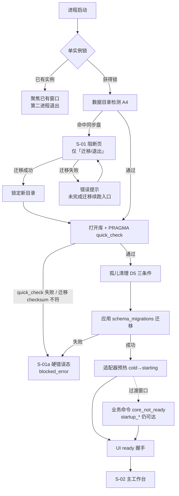
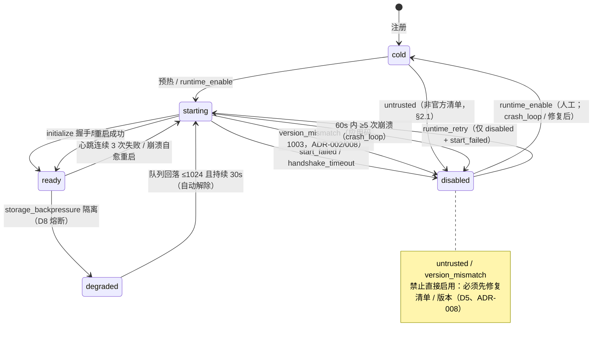
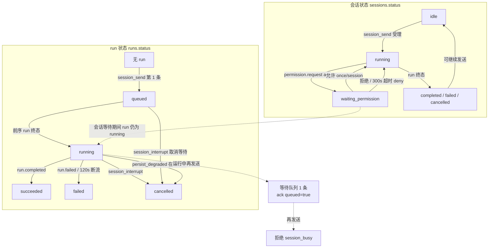
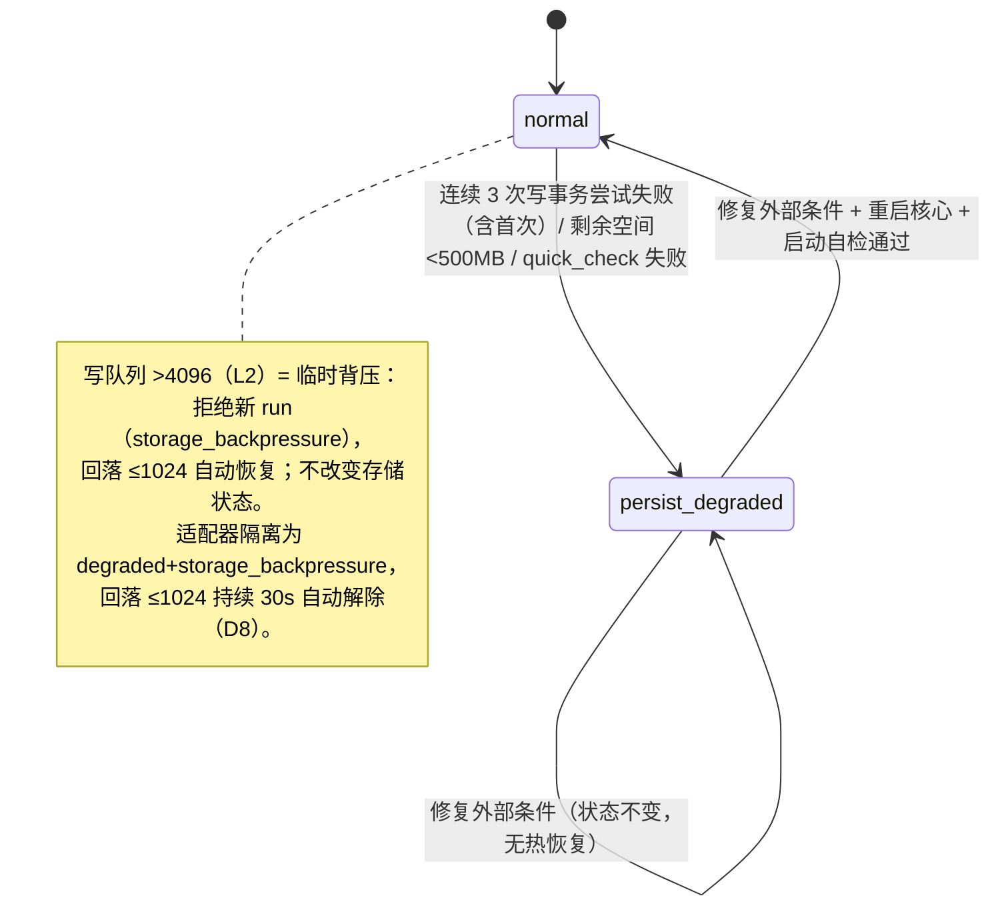

# Aether UI/UX 设计规格 v0.2（已评审通过）

| 项 | 内容 |
|---|---|
| 文档 | Aether UI/UX 设计规格 v0.2（已评审通过） |
| 依据基线 | 《需求文档》v0.7、《设计文档》v1.10（冻结，含 ADR-001–010）、《实施计划与验收标准》v1.17、`AGENTS.md`、ADR-010 |
| 参考对象 | Proma（proma-ai/Proma）信息组织范式；Hermes Studio / Ekko Studio（EKKOLearnAI/hermes-studio）界面范式（仅借鉴公开界面思路，不拷贝代码，A11/SE-05） |
| 效力 | **本文件不构成冻结基线**。与设计文档冲突时以设计文档为准；本文件中的实现偏差须先提 ADR（AGENTS §3） |
| 适用范围 | P0 前端（M3-01…M3-08）与 E2E；P1+ 仅作预留说明，不进入排期 |
| 状态 | **已评审通过（2026-09-24，随 ADR-010 批次）**；v0.2 已回流 ADR-010（文件引用面板 / 思考深度 / 模型与供应商配置，M3-09/M3-10/M3-11）；本文件仍不构成冻结基线（与设计文档冲突以设计文档为准）；「开放问题」未关闭前不得据此定稿 |

**阅读顺序**：§0 硬约束与参考采纳 → §1 界面清单 → §2 线框 → §3 状态图 → §4 组件矩阵 → §5 文案表 → §6 Token/可访问性 → §7 E2E 选择器 → §8 范围冻结 → §9 开放问题。

**与实现现状的关系**（截至 M3-02）：启动加载态、数据目录阻断页、核心健康横幅、会话工作台（左列表 + 中消息流 + 底部输入 + 会话状态条）已实现；本规格中「顶栏合并状态」「右栏辅助面板」「权限审批卡」「备份/恢复页」「设置/诊断/关于页」为 M3-03…M3-08 目标形态，标注了对应任务；v0.2 增补 ADR-010 三项（S-11 文件引用面板、思考深度、模型与供应商配置，M3-09/M3-10/M3-11）。

---

## 0. 硬约束与参考采纳

### 0.1 不可协商的硬约束（UI 设计边界）

| # | 约束 | 依据 | 对 UI 的直接含义 |
|---|---|---|---|
| C1 | 单窗口，无分屏/标签页/多窗口 | 设计 §2.3、§4#20；需求 UI-01 P0 口径「单窗口 + 会话切换」 | 一切界面均为「主工作台 + 覆盖层」；禁止出现 Tab 栏、窗口拆分、多窗口入口 |
| C2 | 无 pause/resume，仅 interrupt | 设计 D8、§4#22；需求 CP-03 P0 口径 | 禁止「暂停/继续」按钮；`sessions.status=paused` 在 P0 不可达，仅保留文案映射 |
| C3 | 无 exec/终端面板 | 设计 D9 策略矩阵（`exec: deny`）、§4#9 | 禁止终端入口、命令输入框、shell 快捷方式 |
| C4 | 无工作流画布/编排 UI | 设计 §4#1（引擎 P2、画布 P4） | 禁止节点/连线/拖拽画布；`tasks/workflows` 表无 UI |
| C5 | 无第三方适配器管理 UI | 设计 §2.1 安全边界、§4#28、D5 准入 | 禁止「安装适配器/插件市场/信任确认」入口；仅官方运行时列表（UI-02） |
| C6 | 权限门边界不得被 UI 误述 | 设计 §2.1 第 4 条、D9 | 权限相关文案必须写明「仅约束经线协议上报的工具调用；适配器进程内行为不受此门约束」 |
| C7 | P0 审计仅三类，无全量审计查询界面 | 设计 §2.1 第 5 条、SE-03、ADR-003/004 | 三类信息分别落在会话列表/权限卡/运行时徽标，不提供「审计查询/导出」页 |
| C8 | `persist_degraded` 不可热恢复 | 设计 D4 状态机、ADR-004 | 只提供「修复外部条件 + 重启应用」引导；禁止「一键恢复」按钮 |
| C9 | Tauri 安全基线：CSP 禁远程内容 | 设计 D7、评审 #7 | 不加载远程字体/脚本/图片；Markdown 禁原始 HTML；外链转交系统浏览器 |
| C10 | 命令面冻结（36 个可调用命令，ADR-010 后） | 设计 D7、ADR-004/006/007/010 | UI 只能调用已登记命令；新增交互能力须先扩命令面（ADR） |

### 0.2 参考设计采纳对照表

| 参考项 | 来源 | 处置 | 替代方案 / 理由 |
|---|---|---|---|
| 左栏 + 主输出 + 右侧工作区三段式 | Proma | **采纳（裁剪）** | 右栏收敛为「运行时状态 / 权限待办 / 文件引用面板（只读，ADR-010）/ 诊断入口」四分区；不设改动/预览/浏览器/终端多标签 |
| 右侧工作区多标签（文件/改动/预览/记忆/聊天/浏览器） | Proma | **采纳（裁剪，ADR-010）** | 仅「文件」只读引用面板（会话文件/项目文件；不列目录、不预览、不落内容体）；改动/预览/记忆/聊天/浏览器仍不采纳（P3/P4） |
| Chrome 风格 Tab 栏 | Proma | **不采纳** | C1；落回 P1（§4#20） |
| 侧边栏 Working 分组（按状态聚合） | Proma | **采纳** | 会话列表按 running / waiting_permission / failed 分组 |
| 状态「线条语言」（弱徽标） | Proma | **采纳** | 会话项左侧 3px 状态线 + 文本标签，不用大色块徽标 |
| Agent 灵动岛（常驻浮窗胶囊） | Proma | **不采纳** | 独立浮窗超范围；替代为窗口内顶栏状态条 + 右栏运行时面板 |
| 权限审批期间输入框可用 | Proma | **部分采纳** | 草稿可编辑；发送受 D8 run 串行约束：第 1 条进入等待队列（`queued=true`），第 2 条起 `session_busy` |
| 卡片 + 阴影取代边框、统一控件尺寸 | Proma | **采纳（视觉）** | 见 §6 Token；P0 用原生控件 + CSS Token 实现，不新增 UI 依赖（§2.10 供应链） |
| 模型选择器信息密度 | Proma | **部分采纳** | 从启用供应商+启用模型派生（ADR-010）；创建会话时指定（UI-05 字段透传）；运行期只读展示（无 update 命令） |
| 多 Agent 群聊 / @mention | Hermes | **不采纳** | §4#2（子 Agent P2） |
| 会话创建/重命名/删除/切换 | Hermes | **部分采纳** | 创建/切换采纳；重命名/删除无命令面（D7），不设计入口（见 §9 开放问题） |
| 按来源分组（Telegram/Discord…） | Hermes | **不采纳** | P0 无远程渠道；替代为按状态分组（备选按 `runtime_id`，见 §9） |
| 工具调用卡片展开（参数/结果） | Hermes | **采纳** | 对应 `tool.call_started/completed/failed`（附录 B）；参数脱敏展示 |
| 会话搜索 Ctrl+K | Hermes | **不采纳** | 无搜索命令面；不得绕过核心管线直读库；落回 P1+（需 ADR） |
| 多页面导航（Chat/Dashboard/Files/Terminal/Jobs） | Hermes | **不采纳** | C1；替代为单窗口覆盖层管理视图（设置/备份/诊断/关于） |
| 深墨 + 克制强调色 Token 方向 | Hermes | **采纳（自定义值）** | §6.1 定义 Aether 自有 Token，深浅主题跟随系统（§4#25：无切换 UI） |

---

## 1. P0 页面清单与信息架构

### 1.1 信息架构总览

单窗口内三种承载形态（互斥或叠加）：

```
阻断页（整窗替换，仅启动门命中时）
  S-01 数据目录阻断/迁移页

主工作台（常驻基座，M3-02 已实现基础版）
  S-02 主工作台（空态 / 加载态 / 正常态）
  ├─ S-03 权限待办（右栏 + 输入区上方审批卡）
  ├─ S-04 运行时状态面板（右栏；顶栏为紧凑徽标）
  ├─ S-11 文件引用面板（右栏只读，ADR-010）
  ├─ S-08 降级横幅 / 只读模式（顶栏下方覆盖条，跨界面常驻）
  └─ S-09 核心未响应（整主区覆盖层）

覆盖层管理视图（从主工作台进入，返回路径固定）
  S-05 设置页
  S-06 备份与恢复页
  S-07 诊断导出页
  S-10 关于页
```

- 覆盖层视图不使用 URL 路由，不新增路由依赖；由 App 层视图状态机管理（建议 `view: "workbench" | "settings" | "backup" | "diagnostics" | "about"`）。
- 启动加载态（S-00）为主工作台之前的前置态，不单独计页。

### 1.2 界面清单

| 编号 | 界面 | 触发条件 | 可达路径 | 核心操作 | 退出/返回 | 依据 | 落地任务 |
|---|---|---|---|---|---|---|---|
| S-00 | 启动加载态 | 应用挂载后 `startup_get` 未返回 | 进程启动 | 无（显示「正在执行启动自检…」） | 自动进入 ready 或 S-01 | D2 启动序列、ADR-006 | M1-06（已实现） |
| S-01 | 数据目录阻断/迁移页 | `startup_get.phase = blocked_sync_dir` | 启动检测命中 A4 同步盘 | 选择目录 → 迁移；退出；未完成迁移续跑 | 迁移成功后自动进入 S-02；退出 = `app_exit` | A4、D1、评审 #9、T13 | M1-06（已实现） |
| S-01a | 阻断硬错误态 | `phase = blocked_error`（迁移失败/库打开失败/迁移 checksum 不符） | S-01 或启动自检失败 | 查看原因；退出 | 仅退出（修复后重启应用） | D3（checksum 拒绝启动）、ADR-006 | M1-06（已实现） |
| S-02 | 主工作台 | `phase = ready` | 启动完成；任一覆盖层返回 | 会话列表/切换、新建会话、发送、中断、重试、查看工具调用 | 常驻 | D7/D8、UI-01/02/05 | M3-02（已实现基础版；顶栏合并见 §9） |
| S-02a | 主工作台空态 | 无会话 / 无运行时 | 同上 | 新建会话（有运行时）；查看「无可用运行时」说明 | — | M3-02 DoD2 | M3-02（已实现） |
| S-02b | 主工作台加载态 | 列表/历史加载中 | 同上 | 无（骨架/文案） | 自动进入正常态 | D8（帧预算） | M3-02 |
| S-03 | 权限待办 | `permission.requested`（`decision=ask`）或 `permissions_pending` 非空 | 事件驱动；右栏常驻分区；顶栏计数徽标 | 允许（once/session）、拒绝、查看原文/规范化对照 | 决议后卡片转结果态；队列清空后分区隐藏 | D9、SE-02、T6/T7 | M3-03 |
| S-04 | 运行时状态面板 | 常驻 | 右栏分区；顶栏徽标点击 | 查看状态/reason/能力；`runtime_retry`（仅 `disabled+start_failed`）；`runtime_enable`（仅 `disabled`） | 常驻；无模态 | D5、M1-10、M2-01 DoD6 | M3-03（M3-02 已有选择器） |
| S-05 | 设置页 | 顶栏「设置」 | S-02 → 覆盖层 | 查看数据目录/安全级别；工作区绑定（`workspace_set`）；备份提醒开关（M3-05 登记键）；跳转备份/诊断/关于 | 「返回工作台」 | D7、D10、D14、D13、M3-05/M3-08 | M3-05 / M3-08 |
| S-06 | 备份与恢复页 | 设置页入口；容量告警横幅入口 | S-02 → 覆盖层 | 手动备份（`backup_create`）、备份列表（`backup_list`）、恢复（`backup_restore`，内部/外部 `.db`）、外部路径空间检查提示 | 「返回工作台」；恢复成功 → 应用重启 | D13、评审 #6、T9/T8 | M3-04 |
| S-07 | 诊断导出页 | 设置页/关于页/降级横幅入口 | S-02 → 覆盖层 | 选择目录 → `export_diagnostics`；查看容量状态（2GB/5GB） | 「返回工作台」 | D11、D13、ADR-007 | M3-05 |
| S-08 | 降级横幅/只读模式 | `health.storage_state=persist_degraded`；或 L2 `storage_backpressure`；或过渡窗口 `core_not_ready` | 覆盖条常驻（主工作台上方） | 查看触发源；`app_restart`（confirm:true）；打开诊断导出；L2 场景为重试提示 | 修复 + 重启后消失；L2 自动消失 | D4、D8、ADR-004/007 | M3-06（横幅骨架 M2-07 已实现） |
| S-09 | 核心未响应 | UI 15s 无 `health` 响应 | 主区覆盖层 | 重启核心（`app_restart`） | 重启后回 S-00/S-02 | D2、M2-07 DoD4/5 | M2-07（已实现） |
| S-10 | 关于页 | 顶栏/设置页入口 | S-02 → 覆盖层 | 查看版本/线协议版本/数据目录/安全边界声明；Mock-only beta 标记（条件显示）；诊断导出入口 | 「返回工作台」 | D7、§2.1、M2-02M DoD3 | M3-05 |
| S-11 | 文件引用面板（只读） | 常驻（Agent 模式右栏） | S-02 → 右栏 | 查看会话文件/项目文件引用与工作区根路径；添加文件/附加文件夹（`ref_pick`+`artifact_add`）；行内删除（`artifact_remove`） | 常驻；可折叠 | D7/D9、ADR-010 | M3-09 |

**不可达界面（P0 明确无入口）**：审计查询、终端、工作流画布、适配器安装、会话搜索、主题切换、账号/云同步。见 §8。

### 1.3 导航与返回规则

- 覆盖层视图**不卸载**主工作台状态（会话、草稿、事件订阅保持），返回时恢复原滚动位置与焦点。
- 覆盖层内 `Esc` = 返回工作台（恢复进入前焦点）；`Tab` 焦点圈定在覆盖层内（`role="dialog"` + `aria-modal="true"`，仅覆盖层视图使用模态语义）。
- 权限审批卡与降级横幅**不使用模态语义**（不夺焦点），以保证 D9/Proma 参考的「审批期间输入可用」。
- 启动门（S-01/S-01a）期间除 `startup_*`/`app_exit` 外业务命令不可达（命令层返回 `startup_blocked`，UI 不渲染入口，双重兜底）。

---

## 2. 主工作台线框

### 2.1 整体线框（目标形态，M3-03 起）

```
┌────────────────────────────────────────────────────────────────────────────────────┐
│ 顶栏  Aether   │ 会话：<标题> [空闲]  run：无进行中   │ ●Claude Code ●Codex ○DSH     │
│                                                      │ 存储:正常  待审批:1  设置 关于 │
├────────────────────┬──────────────────────────────────────────────┬────────────────┤
│ 左栏 18rem          │ 中栏（自适应，最小 28rem）                     │ 右栏 20rem      │
│ ┌ 会话 ──────────┐  │ ┌ 状态条 ──────────────────────────────────┐ │ ┌ 运行时 ────┐ │
│ │ [+ 新建会话]    │  │ │ 会话状态 · run 状态 · [中断] · 已受理#A1 │ │ │ Claude Code│ │
│ │ ─ 运行中 (2)    │  │ └──────────────────────────────────────────┘ │ │ ready      │ │
│ │ │ 会话A   ●    │  │                                              │ │ Codex      │ │
│ │ │ 会话B   ●    │  │ ┌ 消息流（虚拟滚动，锚定底部）────────────┐ │ │ degraded   │ │
│ │ ─ 等待审批 (1)  │  │ │ [你] 用户气泡（纯文本）                  │ │ │ crash_loop │ │
│ │ │ 会话C   等待  │  │ │ [助手] Markdown + 代码高亮               │ │ │ [重试][启用]│ │
│ │ ─ 失败 (1)      │  │ │  ┌ 工具卡片（折叠/展开）──────────────┐  │ │ └────────────┘ │
│ │ │ 会话D   失败  │  │ │  │ fs.write · 完成 · 120ms       ▸   │  │ │ ┌ 权限待办(1)┐ │
│ │ ─ 其他          │  │ │  └────────────────────────────────────┘  │ │ │ 会话C       │ │
│ │ │ 会话E         │  │ │ [助手] 流式…（生成中…）                  │ │ │ fs.write    │ │
│ │ └────────────────┘  │ └──────────────────────────────────────────┘ │ │ [查看]      │ │
│ │ ┌ 运行时 ────────┐  │ ┌ 审批卡（非模态，仅当前会话有 pending 时）┐ │ └────────────┘ │
│ │ │ ○ Claude Code  │  │ │ fs.write · 工作区内文件写入              │ │ ┌ 诊断 ──────┐ │
│ │ │ ○ Codex        │  │ │ 原始：D:\ws\a.txt                        │ │ │ 容量:正常   │ │
│ │ │ ○ DSH          │  │ │ 规范化：D:\ws\a.txt（一致）              │ │ │ [导出诊断]  │ │
│ │ └────────────────┘  │ │ [仅本次允许][本会话允许][拒绝] 剩余 287s │ │ └────────────┘ │
│ │ 标题[____]          │ └──────────────────────────────────────────┘ │ ┌ 文件(只读)┐ │
│ │ 模型[____]          │ ┌ 输入区 ──────────────────────────────────┐ │ │ 会话文件 2 │ │
│ │ [新建会话]          │ │ textarea（Ctrl+Enter 发送）              │ │ │ 项目文件 0 │ │
│ │                     │ │ 模型: deepseek-v4-pro（会话级，只读）     │ │ │[添加][附加]│ │
│ │                     │ │                        [发送]  [中断]    │ │ └───────────┘ │
│ │                     │ └──────────────────────────────────────────┘ │                │
└────────────────────┴──────────────────────────────────────────────┴────────────────┘
```

**断点规则**（窗口 1280×800，min 960×640，D1）：

> 右栏分区（ADR-010）：运行时状态 → 权限待办 → 文件引用面板（只读，§2.6）→ 诊断入口；文件面板为 S-11（M3-09）。

| 宽度 | 布局 |
|---|---|
| ≥1280px | 三栏：18rem / 自适应 / 20rem |
| 960–1279px | 两栏：18rem / 自适应；右栏折叠为顶栏「状态」按钮打开的抽屉（overlay，Esc 关闭） |
| <960px | 不出现（窗口最小宽度 960） |

### 2.2 左侧会话列表区

- **分组方式（P0 默认）**：按会话状态分组，固定组序：`运行中`（running/creating）→ `等待审批`（waiting_permission）→ `失败`（failed）→ `其他`（idle/completed/cancelled）；组内按 `updated_at` 倒序。空组隐藏。
- **状态指示（线条语言）**：列表项左侧 3px 竖线着色（运行中=accent 且带脉冲点、等待审批=warning、失败=danger、其他=透明/弱边框）+ 右侧小字状态标签；不使用大色块徽标。颜色见 §6.4。
- **交互**：
  - 切换：点击列表项 → 激活态（边框 + 背景提升），加载该会话消息基线（`messages_page` 最近一页）。
  - 新建：表单（标题输入 ≤256 字符、模型输入（可选，自由文本）、运行时单选）→ `session_create` → 立即入列表并选中；T1 埋点锚点保留（`create-latency-ms`）。
  - 重命名/删除：**不设计**（D7 命令面无 rename/delete；`session_dispose` 仅关闭不删除）→ 见 §9。
  - 运行中会话置顶于「运行中」组内并显示脉冲点（Hermes 参考；`prefers-reduced-motion` 下降级为静态点，见 §6.7）。
- **运行时选择器**（UI-02）：仅列出官方注册运行时（含 Mock，仅测试构建）；展示 `status` 徽标 + `status_reason` + 能力徽标（`hello` 上报的 capabilities）；`disabled` 运行时不可选（不可创建会话，M3-03 DoD3）。
- 依据：UI-01/02、M3-02、M3-03。

### 2.3 中间消息流区

- **消息气泡**：`messages.role` 四类：
  - `user`：左对齐，纯文本渲染（不解释 Markdown，预格式保留换行；M3-02 现状）。
  - `assistant`：左对齐，Markdown 子集（标题/列表/引用/行内码/代码块/链接），代码块高亮；**禁止原始 HTML**（无 `dangerouslySetInnerHTML`）；链接仅放行 `http(s)`，点击转交系统浏览器（D7 `on_navigation` 兜底）。
  - `system`：居中弱化小字（如「会话已恢复（Mode R）」「原生上下文可能丢失（Mode N）」——重放语义由 M1-11 结论决定，ADR-005）。
  - `tool`：不渲染为独立气泡；按 `run_id`/工具调用 id 并入对应工具调用卡片；无法关联时渲染为折叠的「工具输出」卡片。
- **工具调用卡片**：折叠态 = 工具名 + 状态 + 耗时；展开态 = 参数（脱敏后）+ 结果摘要；`started` 时若该工具调用在等权限，显示「等待审批」并与审批卡联动；详情见 §4.2。
- **虚拟滚动与锚定规则**（D8 帧级批处理；M3-02 DoD4 帧预算）：
  1. 距底部 <48px 视为「贴底」；贴底时新事件/`message.delta` 自动滚动到底部；
  2. 用户上滚超过 48px 后**暂停自动滚动**，出现「有新消息 ↓」浮动按钮；点击回底并恢复自动滚动；
  3. 流式 delta 更新不得使已渲染项的视口位置跳变（以行项 key + 锚点项 offset 补偿）；
  4. 切换会话：默认滚动到底部（P0 不记忆阅读位置）；
  5. 16ms 合并渲染（D8），不得逐事件 flush。
- **空态/错误态**：
  - 无会话：`请选择或新建会话`；
  - 会话无消息：`暂无消息`；
  - 无可用运行时：`无可用运行时（适配器注册随打包里程碑落地）`（M3-02 现状文案）；
  - 历史加载失败：`历史加载失败：{message}` + `重试`（重试 = 重新调用 `messages_page`，不新增命令）；
  - 缺口 >10k：`history-overflow` 提示（M3-01 DoD2，文案见 §5）。
- 依据：D4/D7/D8、附录 B、M3-02、M3-03。

### 2.4 底部输入区

- **文本输入**：`textarea`，Enter 换行、`Ctrl/Cmd+Enter` 发送（M3-02 现状）；草稿为会话级客户端状态（切换会话保留，不落库）。
- **发送/中断**：
  - 发送可用条件：有激活会话 且 非 `persist_degraded` 且 运行时可用 且 草稿非空；
  - 运行中发送：第 1 条 → `queued=true` → 显示「已进入等待队列」（与「已受理」区分）；等待队列已满 → 服务端 `session_busy` → 草稿保留 + 提示，按钮禁用至当前 run 终态（D8 run 串行）；
  - 中断：仅当 `activeRunId != null` 或会话 `running` 时可用（M3-02 现状）；点击 → `session_interrupt` → 等待 `run.cancelled` 事件；按钮进入 pending 态（防重复点击）。
- **模型展示**：会话级模型（`session_create.model`，UI-05）以只读 chip 显示；**运行期不支持切换**（无 update 命令）——见 §9。
- **思考深度（ADR-010）**：输入区 5 档滑块（关闭/低/高/极高/最大，默认「高」）；运行时未声明 `thinking_depth` 能力时置灰 + tooltip「当前运行时不支持思考深度」；值随 `session_create`（会话级）/ `session_send`（本次 run 覆盖）透传；运行期只读语义与模型一致（无 update 命令）；核心警告（`thinking_depth_unsupported`）为同步判定路径兜底（延迟判定以生效值回显为准）。
- **禁用态矩阵**：

| 场景 | 输入框 | 发送 | 中断 | 提示位置 |
|---|---|---|---|---|
| 正常 idle | 可用 | 可用（草稿非空） | 禁用 | — |
| run 运行中 | 可用 | 可用（进队列） | 可用 | 「已进入等待队列」回执 |
| 等待队列已满 | 可用（草稿保留） | 禁用 | 可用 | composer 下方 `session_busy` 提示 |
| `persist_degraded` | 可用（草稿保留） | 禁用 | 禁用（在途已 cancelled） | S-08 横幅 + 按钮旁说明 |
| `storage_backpressure`（L2） | 可用 | 禁用（服务端拒绝新 run） | 依 run 状态 | composer 内联提示 |
| 运行时 `disabled/degraded` | 可用 | 禁用 | 禁用 | 运行时徽标 + 空态说明 |
| 无激活会话 | 禁用 | 禁用 | 禁用 | `请选择或新建会话` |

- 依据：D8、D4、M3-02、M3-06、M3-03。

### 2.5 顶部/侧边状态区

- **顶栏（合并现有状态条 + HealthMonitor + EventBridgeIndicator）**：
  - 左：应用名 + 当前会话标题 + 会话状态 chip；
  - 中：run 状态（无进行中 run / run 运行中 / 等待审批 / 最近终态）；
  - 右：运行时紧凑徽标组（每运行时一个点 + 名称缩写，hover 显示 `status_reason` 中文释义与最近变更时间，点击打开右栏运行时面板）、存储状态（`normal` 时弱化显示，异常时强调并可点击定位横幅）、待审批计数徽标（点击切到对应会话并聚焦审批卡）、`设置`/`关于` 入口；
  - `event-bridge-status`（M3-01 调试指示）移入设置/诊断页，不再出现在主界面（避免用户困惑）。
- **右栏（S-03/S-04/S-11）**：运行时状态面板 + 权限待办 + 文件引用面板（只读，ADR-010，§2.6）+ 诊断入口四分区；右栏在 <1280px 折叠为抽屉。
- **待审批计数来源**：事件流 `permission.requested/resolved` 增量维护 + 打开右栏时 `permissions_pending` 全量校准（不新增轮询）。
- 依据：D5/D9、M2-07、M3-01、M3-03。

### 2.6 右栏文件引用面板（S-11，ADR-010 / M3-09）

- **只读引用**：子 tab「会话文件」（`kind=file`）/「项目文件」（工作区根路径 + `kind=directory`，不递归）；添加文件/附加文件夹经 `ref_pick` → `artifact_add`；行内删除经 `artifact_remove`；搜索仅过滤当前列表；
- **不列目录、不展开文件树、不预览/编辑内容、不读文件字节**；引用路径 canonicalize 后落 `artifacts` 表（跨重启保留）；`改动` tab 无入口；
- **引用 ≠ 预授权**：Agent 读取仍走 `fs.read` 权限门、写入仍走 `fs.write` 审批（D9 不变）；「附加文件夹」不调用 `workspace_set`（工作区绑定仍由 M3-08 承接）；
- 错误呈现：`artifact_path_rejected` 提示路径不可用 + 原因（§5）；`builtin_provider_undeletable` 等供应商错误见设置覆盖层（ADR-010 决策 3）；
- 思考深度滑块见 §2.4；供应商配置页为设置覆盖层内页面（原型 renderModels/renderProviderForm），模型选择器见 §2.4/§9 Q2。

---

## 3. 关键状态流转图

### 3.1 应用启动序列（D2 + A4 + ADR-006/007）



### 3.2 运行时状态（D5 + D8 + ADR-002/004/008）



UI 呈现规则：

| 状态 + reason | 顶栏徽标 | 右栏面板 | 可执行操作 |
|---|---|---|---|
| `cold` | 灰点 + 「未启动」 | 状态行 | 无（等预热/配置） |
| `starting` | 脉冲点 + 「启动中」 | 状态行 | 无 |
| `ready` | 绿点 + 「就绪」 | 能力徽标列表 | 可用于新建会话 |
| `degraded` + `storage_backpressure` | 黄点 + 「降级·存储背压」 | 说明「队列回落 ≤1024 持续 30s 自动恢复」 | 无（自动解除） |
| `disabled` + `start_failed` | 红点 + 「已禁用·启动失败」 | stderr 尾 50 行摘要 | `重试`（runtime_retry） |
| `disabled` + `handshake_timeout` | 红点 + 「已禁用·握手超时」 | 说明 | `重新启用`（runtime_enable） |
| `disabled` + `crash_loop` | 红点 + 「已禁用·崩溃循环」 | 「60s 内 5 次崩溃」 | `重新启用`（runtime_enable） |
| `disabled` + `version_mismatch` | 红点 + 「已禁用·版本不匹配」 | 版本对照 + 升级提示 | 禁用态说明，无启用按钮 |
| `disabled` + `untrusted` | 红点 + 「已禁用·未受信任」 | 白名单说明（P3 前仅官方） | 无 |

### 3.3 run 生命周期与会话状态（D8 + D9 + M2-01）



要点：同一会话同时仅 1 个 run（D8）；权限等待只改变**会话**状态，不改变 run 状态；`paused` 在 P0 不可达（§4#22）；`timeout` 终态（DDL 枚举）按「失败」呈现，文案见 §5。

### 3.4 存储降级（D4 + D8 + ADR-004）



降级期 UI 行为（D4 强制语义）：

1. 横幅（S-08）`role="alert"` 常驻：标题「存储已降级为只读」+ 触发源 + 「写入与新任务已停止；运行中的任务已中断」+ 恢复引导（修复磁盘/目录/权限 → 重启应用）；
2. 发送入口禁用、`session_send`/新 run 全部拒绝（命令返回 `persist_degraded`）；
3. 在途 run 由核心置 `cancelled` → 消息流显示「已中断（存储降级）」+ `重试`（修复后可用）；
4. 读查询、备份/导出（可到外部路径）、诊断导出保持可用；
5. 恢复引导仅提供 `app_restart`（confirm:true）入口；**不提供任何「一键恢复/热恢复」按钮**（C8）。

---

## 4. 组件状态矩阵

### 4.1 消息气泡

| 角色 | 状态 | 视觉 | 交互 | 依据 |
|---|---|---|---|---|
| user | 已发送（唯一正常态） | 左侧 3px accent 线；纯文本；`data-role=user` | 可选中复制；不折叠 | M3-02 现状 |
| user | 发送中（乐观） | 半透明 + 「发送中…」小字 | ack 失败 → 移除气泡 + 恢复草稿 + 错误提示 | D7 ack 快路径 |
| assistant | streaming | `data-streaming=true`；「生成中…」指示；`aria-busy=true` | 不可编辑；delta 按 16ms 合并 | D4/D8 |
| assistant | 完成 | `data-streaming=false`；终稿以 `message.completed` 为准 | 复制、代码块滚动 | D4 |
| assistant | 失败 | 左侧 3px danger 线 + 「运行失败：{code/message}」+ `重试` 按钮（`run_retry`） | 重试仅终态 run 可用 | ADR-004、M3-06 |
| assistant | 已中断 | 灰化 + 「已中断」标签 + `重试` | 同上 | M2-05、M3-06 |
| system | 信息/恢复 | 居中、弱色、小字（如「已用原生会话恢复（Mode R）」/「原生上下文可能丢失（Mode N）」） | 无 | ADR-005 |
| system | 错误（`error` 事件，`recoverable=false`） | 居中 danger 卡片：`{code}` + 文案 + 建议操作（§5） | 按 §5 提供入口（如重启/导出） | 附录 B、D4 |
| tool | — | 不渲染独立气泡，并入工具卡片 | 见 §4.2 | 附录 B |

### 4.2 工具调用卡片

| 状态（`tool.call_*`） | 折叠态 | 展开态 | 交互 |
|---|---|---|---|
| `started` | 工具名 + 「运行中」脉冲点 + 参数摘要 | 参数（脱敏）全文；结果区「等待中」 | 点击/Enter 展开；`aria-expanded` |
| `started` + 权限等待 | 工具名 + 「等待审批」warning 徽标 | 参数 + 「等待用户决议」 | 与审批卡联动（同 `requestId`） |
| `completed` | 工具名 + 「完成」+ `durationMs` | 参数 + 结果摘要（超长截断，提示「完整内容见工作区文件」） | 展开/折叠 |
| `failed` | 工具名 + 「失败」+ 错误码（如 `denied`/`timeout`） | 参数 + 错误详情 | 展开/折叠 |
| 关联不到事件的 `tool` 角色消息 | 「工具输出」折叠卡 | 文本摘要 | 展开/折叠 |

约束：参数按 D4/附录 B 为「已脱敏」；卡片不提供「重新执行」入口（无命令面；重跑走 `run_retry`）。

### 4.3 权限审批卡（S-03）

| 状态 | 视觉 | 可用操作 | 依据 |
|---|---|---|---|
| `pending` | warning 边框卡片，非模态；标题「权限请求」；字段：会话、`resource:action`、**原始 target 原文**、**规范化结果**（并排对照，一致时标注「规范化后一致」）、原因、剩余倒计时（300s） | `仅本次允许`（once）、`本会话允许`（session）、`拒绝`（deny） | D9、附录 C |
| `resolved` | 弱化结果态（保留在消息流/右栏历史）：`已允许（本次/本会话）` 或 `已拒绝` + 时间 | 无（只读） | D9 |
| `timeout` | 弱化 + `已超时自动拒绝（300s）` | 无（只读） | D9 |

规则：
- 同一会话同时最多 1 个激活卡；其余排队显示「还有 N 条排队」（D9）；
- 卡出现**不抢焦点**，经 `aria-live="assertive"` 播报；Tab 顺序在状态条之后、消息流之前；
- 路径原文与规范化结果必须同时展示（防视觉欺骗，D9 评审 #10）；
- `session` 作用域仅限具体 target（D9）；P0 无 `always` 作用域（§2.3、§4#16）；
- 文案必须包含边界声明：「权限门仅约束经线协议上报的工具调用；适配器进程内行为不受此门约束」（C6）；
- 超时倒计时可由 UI 显示（数据源：`permission.requested` 事件 ts + 300s），超时后以 `permission.resolved(deny)`/`permissions` 状态 `timeout` 为准。

### 4.4 运行时徽标

| 状态 | 颜色（§6.4） | 文案 | hover | 点击 |
|---|---|---|---|---|
| `cold` | 弱灰 | 未启动 | 「等待预热或配置」 | 打开右栏运行时面板 |
| `starting` | 信息蓝（脉冲） | 启动中 | 「正在握手 initialize」 | 同上 |
| `ready` | 成功绿 | 就绪 | 能力列表摘要 | 同上 |
| `degraded` | 警告黄 | 降级 | `status_reason` 中文释义 | 同上 |
| `disabled` | 危险红 | 已禁用 | `status_reason` 中文释义 | 同上 |

`status_reason` 五种 + 文案见 §5；`untrusted` / `version_mismatch` 的 hover 必须说明「不可直接启用」及修复路径（D5/ADR-008）。

### 4.5 降级横幅

| 类型 | 触发 | 视觉 | 文案（标题 + 正文） | 操作入口 | 阻断 |
|---|---|---|---|---|---|
| `persist_degraded` | `health.storage_state`（唯一事实源，D4） | 全宽 danger，`role="alert"`，常驻 | 「存储已降级为只读」+「写入与新任务已停止，运行中的任务已中断。触发源：{degrade_trigger}」 | `重启应用`（`app_restart` confirm:true）、`导出诊断`；说明「P0 无热恢复：修复外部条件后重启」 | 写/新 run；读/备份/导出可用 |
| `storage_backpressure` | L2（写队列 >4096）拒绝新 run；或适配器隔离 `degraded+storage_backpressure` | 内联 warning（composer 内）+ 运行时徽标黄点 | 「存储写入繁忙，暂时无法接受新任务（已有任务不受影响），请稍后重试」；隔离变体：「适配器因存储背压被隔离，队列回落后将自动恢复（≤30s）」 | `重试`（重新发送）；无重启入口 | 仅新 run；自动恢复 |
| `core_not_ready` | 启动过渡窗口 `health` 返回该错误 | 顶部 info 条 | 「核心正在初始化，功能暂不可用…」 | 无（自动消失）；>15s → S-09 | 业务命令；`startup_*` 可用 |

---

## 5. 错误码 / 状态码文案表

> 文案为 UI 展示基准（可在实现中微调措辞，不得改变语义与操作口径）；`message` 只用于展示，逻辑判断一律按 `code`（error.rs 注释契约）。

| 码 / 状态 | 来源与依据 | 用户可见文案（中文） | 建议操作 | 是否阻断交互 |
|---|---|---|---|---|
| `startup_blocked` | D7/ADR-006、A4、M1-06 | 「数据目录检测未通过，应用已停止进入主界面」 | 迁移到本地目录 或 退出（仅两选项，无覆盖开关） | 阻断：仅 S-01 两操作可达 |
| `migration_failed` | D7/ADR-006、M1-06 | 「数据迁移失败：{message}。原目录与副本均已保留」 | 重试迁移 / 更换目标目录 / 退出 | 阻断：启动门内 |
| `core_not_ready` | ADR-007 增量 2 | 「核心正在初始化，请稍候…」 | 等待自动重试；持续 >15s → 「核心未响应」+ 重启入口 | 过渡期阻断业务命令（`startup_*` 除外） |
| `storage_backpressure` | D8 L2、ADR-003/004 | 「存储写入繁忙，暂时无法接受新任务（已有任务不受影响）」 | 稍后重试；适配器隔离时等待自动恢复（≤30s） | 阻断新 run；已有 run 继续 |
| `persist_degraded` | D4、ADR-004 | 「存储已降级为只读：写入与新任务已停止，运行中的任务已中断」 | 修复磁盘/目录/权限 → 重启应用（无热恢复） | 阻断写入/新 run；读/备份/诊断可用 |
| `readback_gap_too_large` | D4、ADR-009 | 「历史消息过多，请关闭并重新打开会话。」（现有文案；补充说明可重新加载最近 N 条） | 确认后清缓存重载最近 500 条（不重启核心/应用） | 阻断补读；不阻断输入/发送 |
| `session_busy` | D8 run 串行 | 「当前任务仍在运行，等待队列已满（最多 1 条），请稍后发送」 | 等待当前 run 终态后重发（草稿保留） | 阻断该条发送 |
| `version_mismatch` | D5/ADR-002/ADR-008 | 「运行时版本不匹配：需要 {required}，当前 {found}」 | 升级适配器/应用后重启；不可直接启用 | 阻断该 runtime（`disabled`） |
| `untrusted` | §2.1、§4#28、D5 | 「适配器未通过官方白名单校验，已拒绝加载（P3 沙箱前仅支持官方适配器）」 | 无（不提供启用入口） | 阻断该 runtime |
| `crash_loop` | D5 熔断 | 「运行时 60 秒内崩溃 5 次，已熔断停止（防止崩溃循环）」 | `重新启用` 或修复后重启应用 | 阻断该 runtime 直至人工启用 |
| `memory_conflict` | D14 | 「记忆文件已被外部修改，本次写入已中止（未覆盖原文件）」 | 重新读取记忆后重试 | 阻断该次写入；不阻断会话 |
| `start_failed` / `handshake_timeout` | D5 | 「运行时启动失败（{reason}）」+ stderr 尾 50 行摘要 | `重试`；仍失败检查配置/版本 | 阻断该 runtime |
| `path_rejected` | D9/T7 | 「路径不在允许范围内，已拒绝」 | 无需操作（可展开查看原因） | 阻断该工具调用 |
| `artifact_path_rejected` | ADR-010 | 「引用路径不可用：{message}」 | 重新选择路径 | 阻断该次添加 |
| `builtin_provider_undeletable` | ADR-010 | 「内置供应商不可删除」 | 无（删除入口置灰） | 阻断该次删除 |
| `provider_not_found` / `provider_model_not_found` | ADR-010 | 「供应商/模型不存在，已刷新列表」 | 刷新后重试 | 阻断该命令 |
| `thinking_depth_unsupported`（警告码，非阻断） | ADR-010 | 「当前运行时不支持思考深度，已按默认档位运行」 | 无（滑块置灰） | 非阻断 |
| （UI）连通性测试 | ADR-010 | 「连通性测试将在 P1 开放」 | 无 | 非阻断 |
| `invalid_json` / `unknown_field` / `missing_field` / `invalid_type` / `invalid_value` / `invalid_enum` / `too_large` / `out_of_range` / `invalid_format` | D7/M1-08 | 「输入不合法（{field}）：{message}」 | 修正输入 | 阻断该命令 |
| `not_implemented` | D7 框架 | 「该功能尚未实现（{command}）」 | 无 | 阻断该命令（仅开发期出现） |
| `internal` | ADR-006 | 「内部错误：{message}」 | 重试；持续出现导出诊断 | 阻断该命令 |

---

## 6. 设计 Token 与可访问性基线

### 6.1 颜色 Token

**暗色（P0 默认，跟随 `prefers-color-scheme: dark`）**——与现有 `styles.css` 值兼容：

| Token | 值 | 用途 |
|---|---|---|
| `--ae-bg` | `#14161A` | 应用背景 |
| `--ae-surface` | `#1D2026` | 卡片/面板/气泡 |
| `--ae-surface-raised` | `#232830` | 悬浮/抽屉/激活项 |
| `--ae-border` | `#3A3F47` | 输入框/可聚焦控件边框、分隔线 |
| `--ae-text` | `#E8EAED` | 主文本 |
| `--ae-text-muted` | `#9AA0A6` | 次要文本（时间/角色/提示） |
| `--ae-text-faint` | `#6C7278` | 占位/禁用文本（Hermes 次色方向） |
| `--ae-accent` | `#6F9DD8` | 交互主色（选中/链接/用户线） |
| `--ae-accent-strong` | `#82AAFF` | hover/焦点强调 |
| `--ae-success` | `#8FD18F` | ready/完成 |
| `--ae-warning` | `#F6B26B` | 等待审批/降级/熔断 |
| `--ae-danger` | `#E8A7A7` | 失败/禁用/阻断 |
| `--ae-focus-ring` | `#82AAFF` | 焦点环 |

**亮色（跟随 `prefers-color-scheme: light`；P0 无切换 UI，§4#25）**：

| Token | 值 |
|---|---|
| `--ae-bg` | `#F7F8FA` |
| `--ae-surface` | `#FFFFFF` |
| `--ae-surface-raised` | `#FFFFFF`（配阴影分层） |
| `--ae-border` | `#D8DCE2` |
| `--ae-text` | `#1A1C1E`（Hermes 主色方向） |
| `--ae-text-muted` | `#5F6670` |
| `--ae-text-faint` | `#6C7278` |
| `--ae-accent` | `#2F6FBF` |
| `--ae-accent-strong` | `#1F5AA6` |
| `--ae-success` | `#2E7D32` |
| `--ae-warning` | `#B26A00` |
| `--ae-danger` | `#B8422E`（Hermes 第三色方向） |
| `--ae-focus-ring` | `#2F6FBF` |

### 6.2 字体（CSP 禁远程字体，D7）

- 正文：`-apple-system, "Segoe UI", "PingFang SC", "Microsoft YaHei", "Noto Sans CJK SC", system-ui, sans-serif`
- 等宽：`ui-monospace, "Cascadia Mono", Consolas, "SF Mono", Menlo, monospace`
- 字号：12 / 13 / 14（正文）/ 16 / 20 / 24 px；行高 1.5–1.6；正文 14px。

### 6.3 间距 / 圆角 / 阴影

- 间距刻度（4px 基数）：2 / 4 / 8 / 12 / 16 / 24 / 32 / 48。
- 圆角：控件 4px；卡片 6px；胶囊 999px。
- 阴影（Proma 方向：卡片+阴影取代边框）：`--ae-elev-1: 0 1px 2px rgba(0,0,0,.35)`；`--ae-elev-2: 0 4px 12px rgba(0,0,0,.4)`；亮色对应 `rgba(26,28,30,.08)` / `.12`。边框仅用于输入框、可聚焦控件与结构分隔。

### 6.4 状态色语义

| 语义 | Token | 使用 |
|---|---|---|
| 成功/就绪/完成 | `--ae-success` | runtime ready、tool completed、备份成功 |
| 警告/等待/降级 | `--ae-warning` | waiting_permission、degraded、L2 背压 |
| 错误/失败/禁用 | `--ae-danger` | failed、disabled、persist_degraded、路径拒绝 |
| 进行中 | `--ae-accent` | streaming、running 脉冲、链接 |
| 信息 | `--ae-accent-strong` | core_not_ready、提示 |

**禁止仅用颜色表达状态**：每个状态必须同时有文本标签或图标（色盲可辨）。

### 6.5 键盘导航与快捷键

| 场景 | 按键 | 行为 |
|---|---|---|
| 全局 | `Tab` / `Shift+Tab` | 焦点顺序：顶栏 → 左栏（会话列表 → 运行时选择 → 新建表单）→ 状态条/中断 → 权限卡 → 消息流（可滚动区 `tabindex=0`）→ 输入区（textarea → 发送）→ 右栏 → 横幅操作 |
| 输入区 | `Enter` | 换行 |
| 输入区 | `Ctrl/Cmd+Enter` | 发送（M3-02 现状） |
| 消息流 | `PageUp/PageDown/Home/End` | 滚动；`End` 回底并恢复自动滚动 |
| 运行时选择 | `↑/↓` + `Space/Enter` | radiogroup 选择（`role=radio`） |
| 工具卡片/审批卡 | `Enter/Space` | 展开/折叠；按钮逐个 Tab |
| 覆盖层 | `Esc` | 返回工作台（恢复焦点） |
| 权限卡 | `Esc` | **不作出决议**，焦点返回输入区（防止误拒/误许）；决议必须显式点击 |
| 全局 | `Ctrl+K` | **P0 不绑定**（无搜索命令面）；见 §9 |
| 全局 | `Ctrl+1/2/3` | P0 不绑定（避免与系统/浏览器冲突） |

### 6.6 屏幕阅读器标签

- 消息流：`role="log"` + `aria-live="polite"`（仅追加的完成消息播报）；流式气泡 `aria-busy="true"`，完成后播报「助手回复完成」。
- 状态条：`aria-live="polite"` 播报会话/run 状态变化；中断按钮 `aria-label="中断当前运行"`。
- 降级横幅 / 核心未响应：`role="alert"`（assertive）。
- 权限卡：`role="alertdialog"`（**非模态**：`aria-modal="false"`）+ `aria-labelledby` 指向标题；按钮含完整 `aria-label`（如「仅本次允许写入 D:\ws\a.txt」）。
- 运行时徽标：`aria-label="运行时 {name}：{状态中文}，原因 {reason 中文}"`。
- 表单：`label` 显式关联（标题/模型/迁移目标目录）；错误提示 `aria-describedby` 关联输入。
- 列表：会话列表 `aria-label="会话列表"`；分组标题为真实标题元素（`h3`），非纯样式。

### 6.7 动效与 `prefers-reduced-motion`

- 常规过渡 120ms / 180ms `ease-out`（hover、展开、横幅出现）；流式指示脉冲 1.2s 循环。
- `@media (prefers-reduced-motion: reduce)`：关闭脉冲/过渡动画，流式指示改为静态文本「生成中…」，滚动改为瞬时（`behavior: auto`）。
- 不使用自动播放动画、不使用视差/大幅位移。

### 6.8 安全与合规约束（CSP，D7）

- 不加载远程字体/脚本/图片/iframe；图标使用内联 SVG 或本地资源。
- Markdown 不产生原始 HTML；外链仅 `http(s)` 且转交系统浏览器。
- 不实现 `dangerouslySetInnerHTML`；不引入未在白名单的 UI 依赖（§2.10）。
- 诊断/日志类界面不得回显密钥（D10 脱敏）。

---

## 7. E2E 选择器契约（M3-01…M3-08）

### 7.1 命名规则

1. 全部小写 kebab-case，语义命名，**不含位置序号/数据库 id**；
2. 列表项统一 `data-testid` 相同 + `data-*` 区分（如 `session-item` + `data-session-id`/`data-status`）；
3. 状态一律放 `data-*` 属性，供 `getByTestId(...).dataset` 断言，不新增 testid 变体；
4. testid 必须存在于生产构建（不得仅 dev）；
5. 新增 testid 须登记本表；重命名视为破坏性变更（需在任务证据中说明迁移）。

### 7.2 已实现锚点（M3-01/M3-02，冻结，不得重命名）

| 界面 | data-testid | 关键状态属性 |
|---|---|---|
| 启动加载 | `startup-loading` / `startup-load-error` | — |
| 启动门 | `startup-gate` | `phase`（经快照断言） |
| 启动门-硬错误 | `startup-message` | — |
| 启动门-目录/原因 | `startup-data-dir` / `startup-reasons` / `startup-precision-note` | — |
| 启动门-续跑 | `startup-pending` / `startup-pending-target` / `startup-finish-migration` | — |
| 启动门-操作 | `startup-target` / `startup-pick` / `startup-migrate` / `startup-error` / `startup-exit` | — |
| 健康 | `health-normal` / `health-loading` / `storage-degraded` / `core-unresponsive` / `core-restart` / `core-restart-error` | — |
| 工作台 | `workbench` / `create-latency-ms`（`data-ms`） | — |
| 会话列表 | `session-list` / `session-item` / `session-item-status` / `session-item-model` / `session-list-empty` | `data-session-id`、`data-active` |
| 运行时 | `runtime-selector` / `runtime-option` / `runtime-reason` / `runtime-capabilities` / `capability-badge` / `runtime-list-empty` | `data-runtime-id`、`data-status`、`data-selected` |
| 新建会话 | `session-create-form` / `session-title-input` / `session-model-input` / `session-create-submit` | — |
| 状态条 | `status-bar` / `session-status` / `run-status` / `interrupt` / `last-ack` | `data-status`、`data-run-id` |
| 消息流 | `message-stream` / `message-list` / `message-bubble` / `streaming-indicator` / `message-stream-empty` | `data-role`、`data-streaming`、`data-run-id` |
| 工具调用 | `tool-calls` / `tool-call` | `data-tool-name`、`data-tool-status` |
| 输入区 | `composer` / `composer-input` / `composer-send` | — |
| 错误 | `workbench-error`（`role=alert`） | 需补 `data-code`（见 §7.3） |
| 历史缺口 | `history-overflow` / `history-reload` / `history-reload-error` | — |
| 事件桥（迁往诊断页） | `event-bridge-status` | — |

### 7.3 待实现锚点（M3-03…M3-08）

| 任务 | 界面 | data-testid | 关键状态属性 |
|---|---|---|---|
| M3-03 | 权限待办分区 | `permission-panel` / `permission-queue-count` / `permission-empty` | `data-count` |
| M3-03 | 审批卡 | `permission-card` | `data-status`（pending/resolved/timeout）、`data-request-id` |
| M3-03 | 审批卡-对照 | `permission-target-raw` / `permission-target-canonical` | `data-equal`（原文与规范化是否一致） |
| M3-03 | 审批操作 | `permission-allow-once` / `permission-allow-session` / `permission-deny` | — |
| M3-03 | 超时 | `permission-timeout-note` | `data-remaining-ms` |
| M3-03 | 运行时面板 | `runtime-panel` / `runtime-panel-item` / `runtime-retry` / `runtime-enable` | `data-runtime-id`、`data-status`、`data-reason` |
| M3-03 | 顶栏 | `topbar` / `runtime-badge` / `storage-indicator` / `pending-permission-badge` | `data-status`、`data-count` |
| M3-06 | 降级横幅操作 | `storage-degraded-restart` / `storage-degraded-diagnostics` | — |
| M3-06 | 背压提示 | `storage-backpressure-notice` | `data-scope`（run/adapter） |
| M3-06 | 过渡窗口 | `core-not-ready-banner` | — |
| M3-06 | run 重试 | `run-retry` | `data-run-id` |
| M3-04 | 备份页 | `backup-page` / `backup-create` / `backup-create-label` / `backup-list` / `backup-item` | `data-backup-id`、`data-kind` |
| M3-04 | 恢复 | `backup-restore` / `backup-restore-external` / `backup-restore-confirm` / `backup-restore-result` | `data-source`（internal/external）、`data-result` |
| M3-04 | 容量 | `capacity-status` | `data-level`（ok/warn/critical） |
| M3-05 | 诊断页 | `diagnostics-page` / `diagnostics-target` / `diagnostics-pick` / `diagnostics-export` / `diagnostics-result` | `data-result` |
| M3-05 | 设置页 | `settings-page` / `settings-data-dir` / `settings-security-level` / `settings-backup-reminder` / `settings-workspace` | `data-level`（os/degraded） |
| M3-05 | 关于页 | `about-page` / `about-version` / `about-protocol` / `about-security-boundary` / `about-beta-marker` | — |
| M3-08 | 工作区 | `workspace-pick` / `workspace-root` / `workspace-apply` / `workspace-result` | — |
| M3-09 | 文件面板 | `file-panel` / `file-panel-empty` / `file-panel-session-tab` / `file-panel-project-tab` | — |
| M3-09 | 文件引用项 | `ref-item` / `ref-remove` | `data-ref-kind`（session/project）、`data-artifact-id`、`data-path` |
| M3-09 | 引用操作 | `ref-add-file` / `ref-add-folder` / `ref-pick-error` | — |
| M3-10 | 思考深度 | `thinking-slider` / `thinking-disabled-hint` / `thinking-popover` | `data-value`、`data-enabled` |
| M3-11 | 供应商页 | `providers-page` / `provider-card` / `provider-toggle` / `provider-edit` / `provider-delete` / `provider-test` | `data-provider-id`、`data-enabled`、`data-is-builtin` |
| M3-11 | 供应商删除确认 | `provider-delete-confirm` | — |
| M3-11 | 供应商表单 | `provider-form` / `provider-name-input` / `provider-base-url-input` / `provider-api-key-input` / `provider-api-key-ref-readonly` / `provider-enabled-switch` / `provider-form-save` / `provider-form-back` | — |
| M3-11 | 供应商模型 | `provider-model-item` / `provider-model-toggle` / `provider-model-add` | `data-model-id`、`data-enabled` |
| M3-11 | 模型选择器 | `model-selector` / `model-selector-item` / `model-selector-empty` | `data-provider-id`、`data-model-id` |
| 通用 | 覆盖层 | `overlay-<name>`（settings/backup/diagnostics/about）/ `overlay-back` | — |
| 通用 | 错误码 | 所有错误元素补 `data-code`（`workbench-error`、`startup-error`、`permission-*` 等） | `data-code` |

### 7.4 使用约束

- 断言优先使用 `data-*` 状态属性（如 `data-status="waiting_permission"`），不依赖文案（文案可微调）；
- 列表断言用 `getAllByTestId` + `data-*` 过滤，禁止 `nth-child` 选择器；
- 流式断言：`data-streaming` + `data-run-id`，不等待动画；
- E2E 不得依赖 `event-bridge-status`（非用户面）。

---

## 8. P0 界面范围冻结声明

以下界面能力在 P0 **明确不做**（代码可留结构，但无入口、不承诺行为）：

| # | 不做的界面能力 | 依据 | 落回阶段 |
|---|---|---|---|
| 1 | 分屏 / 标签页 / 多窗口 | §2.3、§4#20 | P1 |
| 2 | 终端面板 / exec 入口 / 命令输入 | D9（`exec: deny`）、§4#9 | P3 |
| 3 | 工作流画布 / 节点编排 / 模板库 | §4#1 | 引擎 P2 / 画布 P4 |
| 4 | 第三方适配器安装 / 管理 / 信任确认 UI | §2.1、§4#28、D5 | P3 |
| 5 | 全量审计查询 / 导出 / 哈希链界面 | §2.1 第 5 条、§4#15、SE-03 | P1（查询导出）/ P3（强化） |
| 6 | pause / resume 按钮 | §4#22、D8 | P1 |
| 7 | 自定义权限规则编辑器 / `always` 作用域 / 自动批准 | D9、§2.3、§4#16 | P1 |
| 8 | 主题切换 UI（P0 深浅色跟随系统即可） | §4#25 | P2 |
| 9 | i18n / 语言切换 | §4#25 | P2 |
| 10 | 官方适配器热插拔 / 启用禁用管理 UI（运行期） | §4#7、RA-05 | P1（运行时 `retry/enable` 仅故障恢复，不属热插拔） |
| 11 | 会话搜索（Ctrl+K）/ 全文检索 | 无命令面（D7）；不得绕过核心管线 | P1+（需 ADR） |
| 12 | 会话重命名 / 删除 | 无命令面（D7） | P1+（需 ADR） |
| 13 | 内嵌浏览器 / 文件浏览器 / 记忆浏览器 | §4#10、D14 | P4（ADR-010 只读引用面板 S-11 为登记例外） |
| 14 | 多模态附件上传 UI | §4#19 | P2 |
| 15 | 自动备份 / 加密备份 UI（P0 仅手动） | §4#13、D13 | P1 |
| 16 | 容量「一键归档」按钮（P0 仅提示占位） | D13 | P1 |
| 17 | 更新器 / 自动升级 UI | §4#23 | P3 |
| 18 | 「一键恢复」/ 热恢复按钮 | D4、ADR-004（C8） | 不计划 |
| 19 | 同步盘「仍要在此运行」覆盖开关 | A4、评审 #9 | 不计划 |
| 20 | 多 Agent 群聊 / @mention | §4#2 | P2 |
| 21 | Dashboard / Files / Terminal / Jobs 多页面路由 | C1 单窗口约束 | 不采纳（形态改为覆盖层） |
| 22 | 遥测 / 崩溃上报 UI | §4#26 | 不计划 |
| 23 | 账号 / 云同步 / 多设备 UI | §4#27 | P6（需 ADR） |
| 24 | 导入 / 导出（JSON/JSONL）界面 | §4#17 | P2 |

> **ADR-010（2026-09-24）登记例外**：S-11 文件引用面板（只读）、思考深度、模型与供应商配置三项 P0 能力为范围冻结的登记例外（豁免对价见 ADR-010 §7）；文件树浏览/改动视图/真实连通性测试/模型删除仍在 P1+/P4，不因本例外提前。

---

## 9. 开放问题（需产品/架构确认后定稿）

| # | 问题 | 建议默认 | 影响 |
|---|---|---|---|
| Q1 | 会话列表默认分组：按状态 / 按 `runtime_id` / 纯时间倒序 | 按状态分组（§2.2） | 左栏信息架构；若按 runtime 分组需评估多运行时下的组数 |
| Q2 | 模型选择器位置：创建表单 / 输入区工具条 | 输入区选择器（ADR-010：作用于新建会话；会话内只读 chip）；运行期切换需 ADR | UI-05 交互与后续「运行期切换模型」需求（需 ADR） |
| Q3 | 权限审批形态：非模态卡片（本规格）vs 模态弹窗（D9 措辞「弹窗」） | 非模态卡片（保证输入可用；Proma 参考） | 需评审确认与 D9 口径一致性 |
| Q4 | 右栏辅助面板是否 P0 必需；1280 宽下默认展开还是折叠 | 默认展开（≥1280），<1280 折叠为抽屉；右栏含文件引用面板（ADR-010，四分区） | 三栏在 1280×800 下的可用宽度 |
| Q5 | `session_dispose`（关闭会话）是否在 P0 暴露 UI 入口 | 暂不暴露（M3-02 未要求） | 会话生命周期完整性；暴露需定义关闭语义与二次确认 |
| Q6 | 会话重命名 / 删除是否需要 ADR 扩命令面 | 不扩（P0 不做） | 与 Hermes 参考的差距；若需要走 ADR + `session_update`/`session_delete` 设计 |
| Q7 | `Ctrl+K` 是否保留为 P1 搜索预留（P0 不绑定） | P0 不绑定，文档标注预留 | 快捷键冲突与用户预期 |
| Q8 | 顶栏状态条与 M3-02 已实现状态条如何合并（避免双状态条） | M3-03 将状态条并入顶栏，消息流上移 | 需在 M3-03 任务范围内登记 |
| Q9 | 设置页 P0 范围：`settings` 键白名单当前为空（`SETTINGS_KEY_ALLOWLIST=[]`）；备份提醒开关（M3-05）与工作区绑定（M3-08）键名/语义需登记 | 仅登记「备份提醒开关」与「工作区绑定」两个键，其余只读展示 | 设置页能否落地；键名是稳定契约，需 ADR/任务证据登记 |
| Q10 | 未备份提醒的关闭粒度：全局关闭 / 仅本次 | 全局开关（M3-05 DoD3「可开关」） | 设置键语义 |
| Q11 | Mock-only beta 标记展示位置（仅 mock-only 路径触发时） | 关于页 + 诊断包 + 启动后一次性横幅（M2-02M DoD3） | 当前为 real-adapter 路径，仅需预留 |
| Q12 | 权限卡是否显示 300s 剩余倒计时 | 显示（数据源为事件 ts + 300s） | 增加视觉噪音，但对「超时自动拒绝」的预期管理有益 |
| Q13 | 流式期间用户上滚后是否暂停自动滚动 | 暂停 + 「有新消息 ↓」（§2.3） | 与 Proma 行为对齐，需 E2E 覆盖 |
| Q14 | 会话草稿是否需要会话级隔离（当前实现为单一草稿） | 会话级草稿（客户端内存，不落库） | 切换会话时的数据丢失风险 |
| Q15 | 右栏「诊断入口」是否直接跳 S-07 还是内联显示容量 | 内联容量摘要 + 「导出诊断」按钮；分区顺序随 ADR-010 登记（运行时→权限→文件→诊断） | 减少一次跳转 |

---

## 附录：界面 ↔ 需求/设计追溯

| 界面 | 需求编号 | 设计条款 | 实施任务 |
|---|---|---|---|
| S-01 阻断/迁移页 | CP-01（配置注册）、DS-01 | A4、D1、评审 #9 | M1-06 |
| S-02 主工作台 | UI-01、UI-02、UI-05、CP-03、CP-04 | D7、D8、§2.3 | M3-02 |
| S-03 权限待办 | SE-02、CP-05 | D9、附录 C `permissions` | M3-03（回环 M2-10） |
| S-04 运行时状态 | UI-02、RA-04、RA-05（P0 仅故障恢复） | D5、M1-10 | M3-03 |
| S-05 设置 | CP-01、DS-03、DS-05 | D7、D10、D14、D13 | M3-05 / M3-08 |
| S-06 备份与恢复 | DS-05 | D13、评审 #6、T8/T9 | M3-04 |
| S-07 诊断导出 | DS-01、SE-03（诊断非审计） | D11、D13、ADR-007 | M3-05 |
| S-08 降级横幅 | CP-03、CP-05 | D4、D8、ADR-004/007 | M2-07 / M3-06 |
| S-09 核心未响应 | CP-03 | D2、M2-07 | M2-07 |
| S-10 关于 | RA-01（协议版本） | D7、§2.1 | M3-05 |
| S-11 文件引用面板 | UI-07 | D7、D9、ADR-010 | M3-09 |

---

*文档结束。本文件为 UI 设计输入，不构成冻结基线；任何与设计文档 v1.9 冲突之处以设计文档为准，实现偏差须先提 ADR。*
